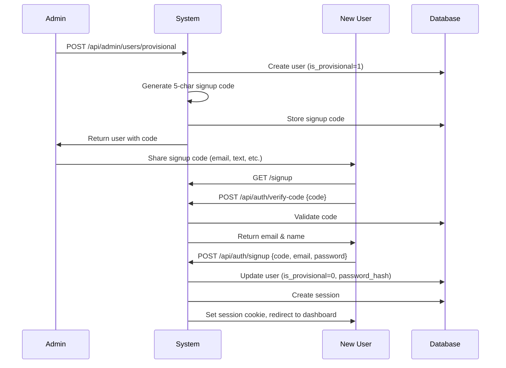
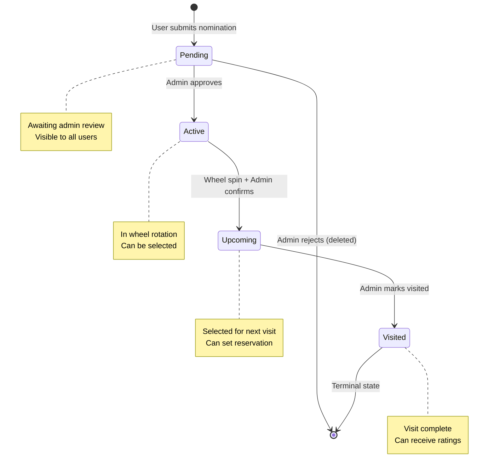
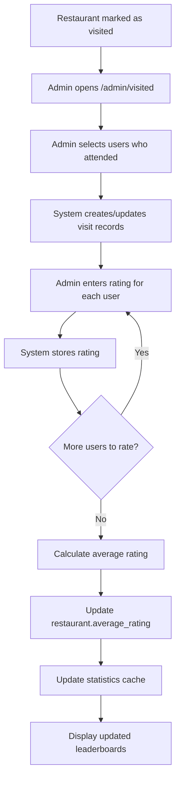
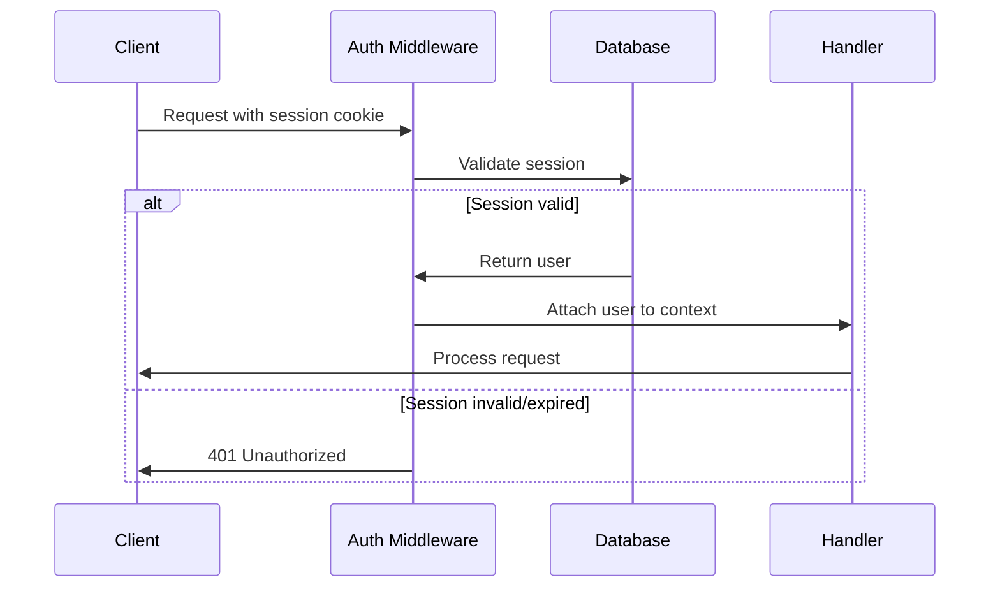

# Product Requirements Document: The Wheel
## Restaurant Selection & Rating System - Version 1.0 Baseline

**Document Version:** 1.0
**Date:** December 2025
**Status:** Baseline for V2 Planning

---

## Table of Contents

1. [System Overview](#1-system-overview)
2. [User Roles & Permissions](#2-user-roles--permissions)
3. [Pages & Features by Role](#3-pages--features-by-role)
4. [Database Schema](#4-database-schema)
5. [API Endpoints & Functionality](#5-api-endpoints--functionality)
6. [Key Workflows](#6-key-workflows)
7. [Business Rules & Constraints](#7-business-rules--constraints)
8. [Configuration & Settings](#8-configuration--settings)
9. [Data Models & Types](#9-data-models--types)
10. [Security Considerations](#10-security-considerations)
11. [Error Handling](#11-error-handling)
12. [Frontend Feature Breakdown](#12-frontend-feature-breakdown)
13. [Migration & Deployment](#13-migration--deployment)
14. [Future Enhancement Opportunities](#14-future-enhancement-opportunities)

---

## 1. System Overview

The Wheel is a collaborative restaurant selection and rating system designed for family/group settings. It automates the process of nominating restaurants, randomly selecting them via a spinning wheel, visiting them, and rating the experience. The system tracks comprehensive statistics about restaurants, user participation, and nomination quality.

### Technology Stack
- **Backend:** Cloudflare Workers (Hono framework) with D1 SQLite database
- **Frontend:** React with TypeScript, Vite, TailwindCSS, React Router
- **Authentication:** Session-based with HTTP-only cookies
- **Architecture:** REST API with server-side rendering support
- **Deployment:** Cloudflare Workers (backend), Vercel (frontend)

### Core Value Proposition
- Eliminates decision paralysis for group dining
- Gamifies restaurant selection through wheel spinning
- Tracks restaurant quality through ratings
- Encourages exploration of new restaurants
- Provides comprehensive analytics on dining patterns

---

## 2. User Roles & Permissions

### 2.1 Regular User

**Capabilities:**
- ✅ View all restaurants across all states
- ✅ Create and submit new restaurant nominations
- ✅ View comprehensive statistics and leaderboards
- ✅ View wheel visualization (read-only)
- ✅ Browse personal nomination history
- ✅ View ratings and reviews for all restaurants

**Limitations:**
- ❌ Cannot spin the wheel
- ❌ Cannot approve/reject nominations
- ❌ Cannot mark restaurants as visited
- ❌ Cannot submit ratings
- ❌ Cannot manage users
- ❌ Cannot access admin dashboard sections

### 2.2 Admin User

**Full Permissions:**
- ✅ All Regular User capabilities
- ✅ Approve or reject pending nominations
- ✅ Spin the wheel to select restaurants randomly
- ✅ Confirm wheel selections to move to upcoming
- ✅ Set reservation dates for upcoming restaurants
- ✅ Mark restaurants as visited
- ✅ Submit ratings for all users
- ✅ Manage attendance tracking
- ✅ Create provisional users with signup codes
- ✅ Edit user information
- ✅ Add emails to whitelist
- ✅ Create restaurants on behalf of other users
- ✅ Delete restaurants
- ✅ Access all admin dashboard sections

**Special Privileges:**
- Can bypass nomination approval for urgent additions
- Can edit any restaurant details
- Can override visit dates and ratings
- Full access to user management

### 2.3 Provisional User

**Status:** Temporary account created by admin awaiting activation

**State:**
- ❌ Cannot log in
- ❌ Cannot perform any actions
- ✅ Has a unique 5-character signup code
- ✅ Email address is reserved

**Activation Workflow:**
1. Admin creates provisional user with email
2. System generates unique 5-character code
3. User receives code (out of band communication)
4. User completes signup form with code
5. User becomes active Regular User

---

## 3. Pages & Features by Role

### 3.1 Public Pages (No Authentication)

| Page | Route | Key Features |
|------|-------|--------------|
| **Login** | `/login` | Email/password authentication, link to signup |
| **Signup** | `/signup` | Two-step verification: code entry, then account details |

### 3.2 Authenticated Pages (All Users)

| Page | Route | Description | Key Features |
|------|-------|-------------|--------------|
| **Dashboard** | `/dashboard` | Landing page after login | Upcoming restaurant highlight, overall stats (avg rating, total restaurants), quick action buttons, "My Nominations" list |
| **Nominations List** | `/nominations` | Browse all restaurants | Grid view of restaurant cards, filter by state (All/Pending/Active/Upcoming/Visited), real-time search, sorting by date |
| **New Nomination** | `/nominations/new` | Submit new restaurant | Form with name, address, fast food toggle, optional menu/photo links |
| **Restaurant Detail** | `/nominations/:id` | Full restaurant information | Complete details, nominator info, rating breakdown, visit history, state badge, action buttons (conditional on role) |
| **Statistics** | `/statistics` | Comprehensive analytics | 7 sections: Restaurant Overview, Rating Stats, User Stats, Top 10 Rated, Most Active Nominators, Most Active Raters, Full Leaderboard, User Rating Averages, Nominator Quality Ratings |

### 3.3 Admin Pages (Admins Only)

| Page | Route | Purpose | Key Features |
|------|-------|---------|--------------|
| **Wheel** | `/wheel` | Spin to select restaurant | Interactive spinning wheel visualization, exclude fast food toggle, active restaurant count, confirm/cancel selection, menu link access |
| **Pending Nominations** | `/admin/pending` | Review submissions | Table of pending restaurants, search functionality, approve/reject buttons, nominator info, creation date |
| **Upcoming Restaurants** | `/admin/upcoming` | Manage scheduled visits | List of confirmed selections, set/edit reservation datetime, mark as visited button |
| **Visited Restaurants** | `/admin/visited` | Record visit details | Table of visited restaurants, add/edit ratings for all users, mark attendance, edit visit date, view current average rating |
| **User Management** | `/admin/users` | Manage user accounts | User table with all details, create provisional user form, edit user name/email, role indicators (admin/provisional) |
| **Admin Nominate** | `/admin/nominate` | Create on behalf of users | Nomination form with user selector dropdown, all standard nomination fields |

---

## 4. Database Schema

### 4.1 Users Table

```sql
CREATE TABLE users (
  id INTEGER PRIMARY KEY AUTOINCREMENT,
  email TEXT UNIQUE NOT NULL,
  password_hash TEXT,              -- Nullable for provisional users
  name TEXT,
  is_admin BOOLEAN DEFAULT 0,
  is_whitelisted BOOLEAN DEFAULT 1,
  is_provisional INTEGER DEFAULT 0,
  signup_code TEXT,                -- 5-character code for signup
  created_at DATETIME DEFAULT CURRENT_TIMESTAMP,
  updated_at DATETIME DEFAULT CURRENT_TIMESTAMP
);

CREATE UNIQUE INDEX idx_users_email ON users(email);
CREATE INDEX idx_users_signup_code ON users(signup_code);
```

**Key Constraints:**
- Email must be unique (enforced at DB level)
- Password nullable only for provisional users
- Signup code must be unique when present
- One admin user required for system operation

**Auto-populated Fields:**
- `created_at`: Set on user creation
- `updated_at`: Updated on any modification
- `signup_code`: Generated as uppercase 5-character string

### 4.2 Restaurants Table

```sql
CREATE TABLE restaurants (
  id INTEGER PRIMARY KEY AUTOINCREMENT,
  name TEXT NOT NULL,
  address TEXT NOT NULL,
  is_fast_food BOOLEAN DEFAULT 0,
  menu_link TEXT,                  -- Optional URL to menu
  photo_link TEXT,                 -- Optional photo URL
  state TEXT DEFAULT 'pending'
    CHECK(state IN ('pending', 'active', 'upcoming', 'visited')),
  nominated_by_user_id INTEGER NOT NULL,
  created_by_admin_id INTEGER,    -- NULL unless admin created on behalf
  average_rating REAL DEFAULT 0,  -- Calculated from visits
  created_at DATETIME DEFAULT CURRENT_TIMESTAMP,
  updated_at DATETIME DEFAULT CURRENT_TIMESTAMP,
  visited_at DATETIME,            -- When visit occurred
  reservation_datetime DATETIME,  -- When reservation scheduled
  FOREIGN KEY (nominated_by_user_id) REFERENCES users(id),
  FOREIGN KEY (created_by_admin_id) REFERENCES users(id)
);

CREATE INDEX idx_restaurants_state ON restaurants(state);
CREATE INDEX idx_restaurants_nominated_by ON restaurants(nominated_by_user_id);
```

**State Machine:**
```
pending → active (approval) | deleted (rejection)
active → upcoming (wheel selection + confirmation)
upcoming → visited (admin action)
visited → [terminal state]
```

**Business Rules:**
- State transitions are one-way (cannot regress)
- `visited_at` only set when state becomes 'visited'
- `reservation_datetime` only relevant for 'upcoming' state
- `average_rating` recalculated whenever ratings added/modified

### 4.3 Visits Table

```sql
CREATE TABLE visits (
  id INTEGER PRIMARY KEY AUTOINCREMENT,
  restaurant_id INTEGER NOT NULL,
  user_id INTEGER NOT NULL,
  attended BOOLEAN DEFAULT 0,
  rating REAL,                    -- Decimal ratings (e.g., 7.5, 10.0)
  created_at DATETIME DEFAULT CURRENT_TIMESTAMP,
  updated_at DATETIME DEFAULT CURRENT_TIMESTAMP,
  FOREIGN KEY (restaurant_id) REFERENCES restaurants(id) ON DELETE CASCADE,
  FOREIGN KEY (user_id) REFERENCES users(id),
  UNIQUE(restaurant_id, user_id) -- One visit per user per restaurant
);

CREATE INDEX idx_visits_restaurant ON visits(restaurant_id);
CREATE INDEX idx_visits_user ON visits(user_id);
```

**Key Constraints:**
- Exactly one visit record per user per restaurant
- Rating is nullable (user may not rate)
- Rating must be positive number if present
- No upper bound on rating value
- Cascading delete: visits deleted when restaurant deleted

**Rating System:**
- Original constraint: 1-5 stars
- Current constraint: Positive decimal (removed upper limit)
- Null rating: User attended but chose not to rate
- Zero rating: Not allowed (must be positive)

### 4.4 Sessions Table

```sql
CREATE TABLE sessions (
  id TEXT PRIMARY KEY,            -- Random session ID
  user_id INTEGER NOT NULL,
  expires_at DATETIME NOT NULL,
  created_at DATETIME DEFAULT CURRENT_TIMESTAMP,
  FOREIGN KEY (user_id) REFERENCES users(id) ON DELETE CASCADE
);

CREATE INDEX idx_sessions_user ON sessions(user_id);
CREATE INDEX idx_sessions_expires ON sessions(expires_at);
```

**Session Management:**
- Session ID: Random UUID
- Default expiry: 30 days from creation
- Automatic cleanup: Expired sessions removed
- Cascading delete: Sessions removed on user deletion
- Cookie: HTTP-only, secure in production

---

## 5. API Endpoints & Functionality

### 5.1 Authentication Endpoints

#### POST `/api/auth/verify-code`
**Auth:** None
**Purpose:** Verify signup code and retrieve associated user info

**Request:**
```json
{
  "signup_code": "ABCDE"
}
```

**Response:**
```json
{
  "email": "user@example.com",
  "name": "John Doe"
}
```

**Errors:**
- 400: Invalid or nonexistent signup code
- 400: User already activated

---

#### POST `/api/auth/signup`
**Auth:** None
**Purpose:** Complete signup using verified code

**Request:**
```json
{
  "signup_code": "ABCDE",
  "email": "user@example.com",
  "password": "securepassword123",
  "name": "John Doe"
}
```

**Response:**
```json
{
  "user": { /* User object */ },
  "session_id": "uuid-session-id"
}
```

**Validation:**
- Email must match signup code
- Password minimum 8 characters
- Code must be valid and unused

**Side Effects:**
- Creates session
- Sets session cookie
- Removes signup code
- Sets `is_provisional = 0`

---

#### POST `/api/auth/login`
**Auth:** None
**Purpose:** Authenticate with email and password

**Request:**
```json
{
  "email": "user@example.com",
  "password": "password123"
}
```

**Response:**
```json
{
  "user": { /* User object */ }
}
```

**Errors:**
- 401: Invalid credentials
- 403: Provisional user (not activated)

**Side Effects:**
- Creates new session
- Sets session cookie
- Updates last login timestamp

---

#### POST `/api/auth/logout`
**Auth:** Required
**Purpose:** End current session

**Response:**
```json
{
  "message": "Logged out successfully"
}
```

**Side Effects:**
- Deletes session from database
- Clears session cookie

---

#### GET `/api/auth/me`
**Auth:** Required
**Purpose:** Get current user details

**Response:**
```json
{
  "user": {
    "id": 1,
    "email": "user@example.com",
    "name": "John Doe",
    "is_admin": false,
    "is_whitelisted": true,
    "is_provisional": false,
    "created_at": "2025-01-01T00:00:00Z"
  }
}
```

---

### 5.2 Restaurant Endpoints

#### GET `/api/restaurants`
**Auth:** None
**Purpose:** Get all restaurants with optional filtering

**Query Parameters:**
- `state` (optional): Filter by state (pending/active/upcoming/visited)
- `user_id` (optional): Filter by nominator

**Response:**
```json
{
  "restaurants": [
    {
      "id": 1,
      "name": "Restaurant Name",
      "address": "123 Main St",
      "is_fast_food": false,
      "menu_link": "https://example.com/menu",
      "photo_link": "https://example.com/photo.jpg",
      "state": "active",
      "nominated_by_user_id": 2,
      "created_by_admin_id": null,
      "average_rating": 8.5,
      "created_at": "2025-01-01T00:00:00Z",
      "updated_at": "2025-01-05T00:00:00Z",
      "visited_at": null,
      "reservation_datetime": null,
      "nominated_by": { /* User object */ }
    }
  ]
}
```

---

#### GET `/api/restaurants/:id`
**Auth:** None
**Purpose:** Get single restaurant with full details

**Response:**
```json
{
  "restaurant": { /* Restaurant object with populated nominated_by */ }
}
```

**Errors:**
- 404: Restaurant not found

---

#### GET `/api/restaurants/stats/overall`
**Auth:** None
**Purpose:** Get overall statistics across all visited restaurants

**Response:**
```json
{
  "overall_average_rating": 7.8,
  "rated_restaurant_count": 42
}
```

**Calculation:**
- Average of all restaurant `average_rating` values
- Only includes visited restaurants with ratings

---

#### POST `/api/restaurants`
**Auth:** Required
**Purpose:** Create new restaurant nomination

**Request:**
```json
{
  "name": "New Restaurant",
  "address": "456 Oak Ave",
  "is_fast_food": false,
  "menu_link": "https://example.com/menu",
  "photo_link": "https://example.com/photo.jpg",
  "nominated_by_user_id": 2  // Optional, admin only
}
```

**Response:**
```json
{
  "restaurant": { /* Created restaurant object */ }
}
```

**Validation:**
- Name and address required
- URLs must be valid if provided
- `nominated_by_user_id` defaults to current user
- Admins can specify different nominator

**Side Effects:**
- Creates restaurant with state='pending'
- Populates `nominated_by_user_id` from token or request
- Sets `created_by_admin_id` if admin creating for user

---

#### PATCH `/api/restaurants/:id`
**Auth:** Required (Admin)
**Purpose:** Update restaurant details

**Request:**
```json
{
  "name": "Updated Name",
  "address": "New Address",
  "is_fast_food": true,
  "menu_link": "https://newmenu.com",
  "photo_link": "https://newphoto.com",
  "state": "active",
  "visited_at": "2025-01-15T18:00:00Z",
  "reservation_datetime": "2025-01-20T19:00:00Z"
}
```

**Response:**
```json
{
  "restaurant": { /* Updated restaurant object */ }
}
```

**Validation:**
- State must be valid enum value
- Cannot regress state (e.g., visited → active not allowed)
- Dates must be valid ISO 8601

---

#### DELETE `/api/restaurants/:id`
**Auth:** Required (Admin)
**Purpose:** Delete restaurant (typically only used for rejected pending nominations)

**Response:**
```json
{
  "message": "Restaurant deleted successfully"
}
```

**Side Effects:**
- Cascading delete of all associated visits
- Permanent deletion (no soft delete)

---

#### POST `/api/restaurants/:id/approve`
**Auth:** Required (Admin)
**Purpose:** Approve pending nomination (pending → active)

**Response:**
```json
{
  "restaurant": { /* Updated restaurant with state='active' */ }
}
```

**Validation:**
- Restaurant must be in 'pending' state
- Only admins can approve

---

#### POST `/api/restaurants/:id/reject`
**Auth:** Required (Admin)
**Purpose:** Reject pending nomination (deletes restaurant)

**Response:**
```json
{
  "message": "Restaurant rejected and deleted"
}
```

**Validation:**
- Restaurant must be in 'pending' state
- Permanently deletes restaurant

---

#### POST `/api/restaurants/:id/confirm-upcoming`
**Auth:** Required (Admin)
**Purpose:** Confirm wheel selection (active → upcoming)

**Response:**
```json
{
  "restaurant": { /* Updated restaurant with state='upcoming' */ }
}
```

**Validation:**
- Restaurant must be in 'active' state
- Typically called after wheel spin and admin confirmation

---

#### POST `/api/restaurants/:id/mark-visited`
**Auth:** Required (Admin)
**Purpose:** Mark restaurant as visited (upcoming → visited)

**Response:**
```json
{
  "restaurant": { /* Updated restaurant with state='visited', visited_at set */ }
}
```

**Validation:**
- Restaurant must be in 'upcoming' state
- Sets `visited_at` to current timestamp

---

### 5.3 Wheel Endpoints

#### GET `/api/wheel/active`
**Auth:** Required
**Purpose:** Get all active restaurants for wheel display

**Query Parameters:**
- `exclude_fast_food` (optional): Boolean to exclude fast food

**Response:**
```json
{
  "restaurants": [ /* Array of active restaurants */ ]
}
```

---

#### POST `/api/wheel/spin`
**Auth:** Required (Admin)
**Purpose:** Randomly select an active restaurant

**Request:**
```json
{
  "exclude_fast_food": true
}
```

**Response:**
```json
{
  "restaurant": { /* Randomly selected restaurant */ }
}
```

**Algorithm:**
- Fetches all active restaurants (optionally excluding fast food)
- Randomly selects one using cryptographically secure random
- Does NOT change restaurant state
- Returns selected restaurant for admin review

---

### 5.4 Visits & Rating Endpoints

#### GET `/api/visits/:restaurantId`
**Auth:** Required
**Purpose:** Get all visits/ratings for a restaurant

**Response:**
```json
{
  "visits": [
    {
      "id": 1,
      "restaurant_id": 5,
      "user_id": 2,
      "attended": true,
      "rating": 8.5,
      "created_at": "2025-01-15T00:00:00Z",
      "updated_at": "2025-01-15T00:00:00Z",
      "user": { /* User object */ }
    }
  ]
}
```

---

#### POST `/api/visits/:restaurantId/attendance`
**Auth:** Required (Admin)
**Purpose:** Mark which users attended a visit

**Request:**
```json
{
  "user_ids": [1, 2, 3, 5]
}
```

**Response:**
```json
{
  "message": "Attendance marked successfully"
}
```

**Side Effects:**
- Creates or updates visit records for all users
- Sets `attended=true` for listed users
- Sets `attended=false` for other users (if visit exists)

---

#### POST `/api/visits/:restaurantId/rate`
**Auth:** Required (Admin)
**Purpose:** Submit or update rating for a user

**Request:**
```json
{
  "user_id": 2,
  "rating": 8.5
}
```

**Response:**
```json
{
  "visit": { /* Updated visit object */ }
}
```

**Validation:**
- Rating must be positive number
- Creates visit record if doesn't exist
- Updates existing rating if present

**Side Effects:**
- Recalculates restaurant's `average_rating`
- Only includes ratings from attended users

---

### 5.5 Admin Endpoints

#### GET `/api/admin/users`
**Auth:** Required (Admin)
**Purpose:** Get all users with details

**Response:**
```json
{
  "users": [
    {
      "id": 1,
      "email": "admin@example.com",
      "name": "Admin User",
      "is_admin": true,
      "is_whitelisted": true,
      "is_provisional": false,
      "created_at": "2025-01-01T00:00:00Z"
    }
  ]
}
```

---

#### PATCH `/api/admin/users/:id`
**Auth:** Required (Admin)
**Purpose:** Update user name or email

**Request:**
```json
{
  "name": "New Name",
  "email": "newemail@example.com"
}
```

**Response:**
```json
{
  "user": { /* Updated user object */ }
}
```

**Validation:**
- Email must be unique if changed
- Cannot change admin status via this endpoint

---

#### POST `/api/admin/users/provisional`
**Auth:** Required (Admin)
**Purpose:** Create provisional user with signup code

**Request:**
```json
{
  "email": "newuser@example.com",
  "name": "New User"
}
```

**Response:**
```json
{
  "user": {
    "id": 10,
    "email": "newuser@example.com",
    "name": "New User",
    "is_provisional": true,
    "signup_code": "ABC12",
    "is_admin": false
  }
}
```

**Side Effects:**
- Generates unique 5-character signup code
- Creates user with `is_provisional=1`
- Password is null until activation
- Auto-detects admin status from email configuration

---

#### POST `/api/admin/users/whitelist`
**Auth:** Required (Admin)
**Purpose:** Add email to whitelist

**Request:**
```json
{
  "email": "approved@example.com"
}
```

**Response:**
```json
{
  "message": "Email added to whitelist",
  "email": "approved@example.com"
}
```

**Note:** Currently adds to in-memory whitelist; may need DB persistence

---

#### GET `/api/admin/nominations/pending`
**Auth:** Required (Admin)
**Purpose:** Get all pending nominations (alias for GET /api/restaurants?state=pending)

**Response:**
```json
{
  "nominations": [ /* Array of pending restaurants */ ]
}
```

---

### 5.6 Statistics Endpoint

#### GET `/api/statistics`
**Auth:** Required
**Purpose:** Get comprehensive statistics object

**Response:**
```json
{
  "totalRestaurants": 150,
  "pendingRestaurants": 12,
  "activeRestaurants": 45,
  "upcomingRestaurants": 3,
  "visitedRestaurants": 90,
  "fastFoodCount": 60,
  "nonFastFoodCount": 90,

  "overallAverageRating": 7.8,
  "totalRatingsGiven": 450,
  "ratedRestaurantCount": 85,
  "unratedRestaurantCount": 5,

  "totalUsers": 25,
  "adminCount": 3,
  "provisionalCount": 2,

  "topRatedRestaurants": [
    {
      "id": 5,
      "name": "Best Restaurant",
      "average_rating": 9.5,
      "rating_count": 20
    }
  ],

  "mostActiveNominators": [
    {
      "id": 2,
      "name": "John Doe",
      "email": "john@example.com",
      "nomination_count": 15
    }
  ],

  "mostActiveRaters": [
    {
      "id": 3,
      "name": "Jane Smith",
      "email": "jane@example.com",
      "rating_count": 75
    }
  ],

  "restaurantLeaderboard": [
    /* All rated restaurants sorted by rating */
  ],

  "userRatingAverages": [
    {
      "id": 2,
      "name": "John Doe",
      "email": "john@example.com",
      "average_rating": 8.2,
      "rating_count": 45
    }
  ],

  "nominatorRestaurantAverages": [
    {
      "id": 2,
      "name": "John Doe",
      "email": "john@example.com",
      "average_rating": 7.9,
      "nominated_count": 15,
      "visited_nominated_count": 12
    }
  ]
}
```

**Calculation Notes:**
- `overallAverageRating`: Average of restaurant averages (visited only)
- `userRatingAverages`: How generously each user rates
- `nominatorRestaurantAverages`: Average of averages of each user's visited nominations (average of averages, not all individual ratings)

---

## 6. Key Workflows

### 6.1 User Registration & Activation Workflow



**Key Decision Points:**
1. Admin decides whether to whitelist email first
2. User must use exact email associated with code
3. Password must meet minimum requirements
4. Activation is atomic (either succeeds completely or fails)

---

### 6.2 Restaurant Nomination & Selection Workflow



**Detailed Steps:**

1. **Nomination Creation**
   - User fills form with restaurant details
   - System validates inputs (required fields, URL formats)
   - Restaurant created with `state='pending'`
   - Nominator ID recorded

2. **Admin Review**
   - Admin views `/admin/pending`
   - Reviews restaurant details
   - Can approve (→ active) or reject (→ deleted)
   - Can edit details before approving

3. **Wheel Selection**
   - Admin navigates to `/wheel`
   - Optionally excludes fast food
   - Clicks "SPIN THE WHEEL"
   - System randomly selects from active restaurants
   - Wheel animates for 4 seconds
   - Admin reviews selection
   - Admin confirms (→ upcoming) or cancels (spin again)

4. **Upcoming Management**
   - Admin sets reservation datetime (optional)
   - Coordinates with group members
   - When visit occurs, admin marks as visited (→ visited)

5. **Visit & Rating**
   - Admin marks which users attended
   - Admin submits ratings for each user
   - System recalculates average rating
   - Restaurant now appears in statistics

---

### 6.3 Rating & Statistical Updates Workflow



**Average Calculation Logic:**
```typescript
// Only include ratings from users who attended
const attendedRatings = visits
  .filter(v => v.attended && v.rating !== null)
  .map(v => v.rating);

const average = attendedRatings.length > 0
  ? attendedRatings.reduce((sum, r) => sum + r, 0) / attendedRatings.length
  : 0;

restaurant.average_rating = average;
```

---

### 6.4 Session & Authentication Workflow



**Session Management:**
- Session ID stored in HTTP-only cookie
- Session validated on every protected route
- Expired sessions automatically invalid
- Logout deletes session from database
- Multiple sessions per user allowed (different devices)

---

## 7. Business Rules & Constraints

### 7.1 User Management Rules

#### Signup & Activation
- ✅ Only whitelisted emails can create accounts OR must use valid signup code
- ✅ Admin emails auto-detected from configuration file
- ❌ Provisional users cannot login until activated via signup flow
- ✅ Password minimum 8 characters (no special char requirements)
- ✅ Email validation enforced (valid email format)
- ✅ One user per email (unique constraint at DB level)
- ✅ Names are optional but encouraged

#### User Roles
- ✅ Admin status immutable after account creation
- ✅ Provisional status removed upon activation
- ✅ Whitelisted status can be toggled by admin
- ❌ Users cannot self-promote to admin
- ✅ At least one admin required for system operation

---

### 7.2 Restaurant Rules

#### Creation & State
- ✅ Name and address are required fields
- ✅ Menu/photo links optional but must be valid URLs if provided
- ✅ State must be one of: pending, active, upcoming, visited
- ✅ New restaurants always start as 'pending'
- ❌ Only pending restaurants can be rejected/deleted
- ✅ Only active restaurants appear on the wheel
- ✅ Only upcoming restaurants can be marked as visited
- ❌ Restaurants cannot transition backwards in state

#### Fast Food Classification
- ✅ Binary classification (fast food or not)
- ✅ Can be toggled by admin after creation
- ✅ Fast food restaurants can be excluded from wheel
- ✅ No impact on other features (ratings, statistics)

#### Deletion Rules
- ✅ Pending restaurants can be deleted (rejection)
- ⚠️ Deleting other states should be rare (data integrity)
- ✅ Cascading delete of all associated visits
- ❌ No soft delete implemented (permanent deletion)

---

### 7.3 Rating Rules

#### Rating Values
- ✅ Ratings must be positive numbers (> 0)
- ❌ No upper limit on rating value
- ✅ Decimal ratings supported (e.g., 7.5, 8.3)
- ❌ Zero ratings not allowed (must be positive)
- ✅ Null ratings allowed (user attended but didn't rate)

#### Rating Submission
- ✅ One rating per user per restaurant
- ✅ Ratings can be updated after initial submission
- ✅ Only admins can submit/edit ratings
- ✅ Ratings only available for visited restaurants
- ❌ Users cannot rate their own nominations differently

#### Average Calculation
- ✅ Average calculated from attended users only
- ✅ Null ratings excluded from average calculation
- ✅ Average stored as REAL (decimal) in database
- ✅ Average updated immediately when ratings change
- ✅ Display format: X.X out of 10 (one decimal place)

---

### 7.4 Wheel Rules

#### Selection Process
- ✅ Only active restaurants appear in wheel pool
- ✅ Fast food can be optionally excluded
- ✅ Selection is cryptographically random
- ❌ Selection does NOT automatically change restaurant state
- ✅ Admin must explicitly confirm to move to 'upcoming'
- ✅ Multiple spins allowed before confirmation
- ✅ Spin animation takes 4 seconds

#### Wheel Behavior
- ✅ Wheel displays all eligible restaurants equally
- ✅ Visual animation provides engagement
- ✅ Can cancel selection and spin again
- ✅ Confirmation is deliberate action (prevents accidents)
- ❌ No weighted selection (all restaurants equal probability)

---

### 7.5 Statistical Calculation Rules

#### Overall Statistics
- ✅ Overall average: Average of restaurant averages (visited only)
- ✅ Only includes restaurants with at least one rating
- ✅ Excludes unvisited restaurants from calculations
- ✅ Real-time calculation (no caching)

#### User Metrics
- ✅ User rating average: How generously user rates (AVG of all their ratings)
- ✅ Nominator quality: Average of averages of their visited nominations
- ✅ Only counts nominators with at least one visited nomination
- ✅ Activity counts include all states

#### Leaderboards
- ✅ Top 10 lists limit to 10 entries
- ✅ Full leaderboard shows all rated restaurants
- ✅ Ties handled by secondary sort (rating count, then ID)
- ✅ Leaderboards refresh on page load

---

### 7.6 Data Integrity Rules

#### Foreign Keys
- ✅ All foreign keys enforced at database level
- ✅ Cascading deletes where appropriate (visits → restaurant)
- ❌ Cannot delete user if they have nominations (would break data)
- ✅ Nominated-by user preserved even if admin created

#### Timestamps
- ✅ `created_at` immutable after creation
- ✅ `updated_at` automatically updated on modification
- ✅ `visited_at` only set when state changes to 'visited'
- ✅ All timestamps in UTC

#### Uniqueness
- ✅ Email unique per user
- ✅ One visit per user per restaurant
- ✅ Session ID unique
- ✅ Signup code unique when present

---

## 8. Configuration & Settings

### 8.1 Backend Configuration

**Environment Variables:**
- `FRONTEND_URL`: Frontend origin for CORS (default: http://localhost:5173)
- `ENVIRONMENT`: 'production' or 'development'
- `DB`: D1 database binding (configured in wrangler.toml)

**Hardcoded Configuration** (`backend/src/config.ts`):
```typescript
export const config = {
  adminEmails: ['sebpartof2@gmail.com'],
  emailWhitelist: ['sebpartof2@gmail.com'],

  session: {
    expiryDays: 30,
    cookieName: 'wheel_session',
    secure: process.env.ENVIRONMENT === 'production',
    httpOnly: true,
    sameSite: 'lax'
  },

  password: {
    minLength: 8,
    bcryptRounds: 10
  },

  signupCode: {
    length: 5,
    characters: 'ABCDEFGHJKLMNPQRSTUVWXYZ23456789' // No ambiguous chars
  }
};
```

### 8.2 Frontend Configuration

**Environment Variables:**
- `VITE_API_URL`: Backend API URL (default: /api for same-origin)

**React Query Configuration:**
```typescript
const queryClient = new QueryClient({
  defaultOptions: {
    queries: {
      staleTime: 1000 * 60 * 5,  // 5 minutes
      retry: 1,
      refetchOnWindowFocus: false
    }
  }
});
```

### 8.3 Deployment Configuration

**Backend** (`backend/wrangler.toml`):
```toml
name = "restaurant-wheel-api"
main = "src/index.ts"
compatibility_date = "2024-01-01"

[[d1_databases]]
binding = "DB"
database_name = "restaurant-wheel-db"
database_id = "c589926f-01a5-46db-8d3b-32cc83582c31"

[vars]
ENVIRONMENT = "production"
FRONTEND_URL = "https://wheel.sebbyboe.online"
```

**Frontend** (`frontend/vercel.json`):
```json
{
  "routes": [
    {
      "handle": "filesystem"
    },
    {
      "src": "/(.*)",
      "dest": "/index.html"
    }
  ]
}
```

---

## 9. Data Models & Types

### 9.1 Core Type Definitions

```typescript
// User type
interface User {
  id: number;
  email: string;
  name?: string;
  is_admin: boolean;
  is_whitelisted: boolean;
  is_provisional: boolean;
  signup_code?: string;
  created_at: string;
}

// Restaurant type
type RestaurantState = 'pending' | 'active' | 'upcoming' | 'visited';

interface Restaurant {
  id: number;
  name: string;
  address: string;
  is_fast_food: boolean;
  menu_link: string | null;
  photo_link: string | null;
  state: RestaurantState;
  nominated_by_user_id: number;
  created_by_admin_id: number | null;
  average_rating: number;
  created_at: string;
  updated_at: string;
  visited_at: string | null;
  reservation_datetime: string | null;
  nominated_by?: User;  // Populated from JOIN
}

// Visit type
interface Visit {
  id: number;
  restaurant_id: number;
  user_id: number;
  attended: boolean;
  rating: number | null;
  created_at: string;
  updated_at: string;
  user?: User;  // Populated from JOIN
}

// Session type
interface Session {
  id: string;
  user_id: number;
  expires_at: string;
}
```

### 9.2 API Request/Response Types

```typescript
// Authentication
interface SignupRequest {
  signup_code: string;
  email: string;
  password: string;
  name?: string;
}

interface LoginRequest {
  email: string;
  password: string;
}

interface VerifyCodeRequest {
  signup_code: string;
}

interface AuthResponse {
  user: User;
  session_id: string;
}

// Restaurant management
interface CreateRestaurantRequest {
  name: string;
  address: string;
  is_fast_food: boolean;
  menu_link?: string;
  photo_link?: string;
  nominated_by_user_id?: number;  // Admin only
}

interface UpdateRestaurantRequest {
  name?: string;
  address?: string;
  is_fast_food?: boolean;
  menu_link?: string;
  photo_link?: string;
  state?: RestaurantState;
  visited_at?: string;
  reservation_datetime?: string;
}

// Wheel
interface SpinWheelRequest {
  exclude_fast_food: boolean;
}

interface SpinWheelResponse {
  restaurant: Restaurant;
}

// Visits & Ratings
interface MarkAttendanceRequest {
  user_ids: number[];
}

interface SubmitRatingRequest {
  user_id: number;
  rating: number;
}

// Admin
interface AddToWhitelistRequest {
  email: string;
}

interface CreateProvisionalUserRequest {
  email: string;
  name?: string;
}
```

### 9.3 Statistics Types

```typescript
interface Statistics {
  // Restaurant counts
  totalRestaurants: number;
  pendingRestaurants: number;
  activeRestaurants: number;
  upcomingRestaurants: number;
  visitedRestaurants: number;
  fastFoodCount: number;
  nonFastFoodCount: number;

  // Rating statistics
  overallAverageRating: number;
  totalRatingsGiven: number;
  ratedRestaurantCount: number;
  unratedRestaurantCount: number;

  // User statistics
  totalUsers: number;
  adminCount: number;
  provisionalCount: number;

  // Top 10 lists
  topRatedRestaurants: Array<{
    id: number;
    name: string;
    average_rating: number;
    rating_count: number;
  }>;

  mostActiveNominators: Array<{
    id: number;
    name: string | null;
    email: string;
    nomination_count: number;
  }>;

  mostActiveRaters: Array<{
    id: number;
    name: string | null;
    email: string;
    rating_count: number;
  }>;

  // Extended leaderboards
  restaurantLeaderboard: Array<{
    id: number;
    name: string;
    average_rating: number;
    rating_count: number;
    state: string;
  }>;

  userRatingAverages: Array<{
    id: number;
    name: string | null;
    email: string;
    average_rating: number;
    rating_count: number;
  }>;

  nominatorRestaurantAverages: Array<{
    id: number;
    name: string | null;
    email: string;
    average_rating: number;
    nominated_count: number;
    visited_nominated_count: number;
  }>;
}
```

---

## 10. Security Considerations

### 10.1 Authentication & Authorization

#### Session Management
- ✅ HTTP-only cookies (prevents XSS access)
- ✅ Secure flag in production (HTTPS only)
- ✅ SameSite=Lax (CSRF protection)
- ✅ 30-day expiry with rolling window
- ✅ Session IDs are UUIDs (cryptographically random)
- ✅ Sessions stored server-side (not JWT)

#### Password Security
- ✅ bcrypt hashing with 10 rounds
- ✅ Passwords never returned in API responses
- ✅ Minimum 8-character requirement
- ❌ No special character requirement (usability over security)
- ✅ Password hashes stored, never plaintext
- ✅ Password reset not implemented (manual admin intervention)

#### Authorization Checks
- ✅ Auth middleware validates session on all protected routes
- ✅ Admin middleware enforces admin-only access
- ✅ User context attached to request after validation
- ✅ Route-level authorization (not just frontend hiding)
- ✅ Foreign key checks prevent unauthorized data access

### 10.2 Input Validation & Sanitization

#### Server-Side Validation
- ✅ Email format validation
- ✅ URL validation for menu/photo links
- ✅ State enum validation
- ✅ Rating positivity validation
- ✅ Required field checks
- ✅ Type checking (TypeScript + runtime)

#### SQL Injection Prevention
- ✅ Parameterized queries (D1 prepared statements)
- ✅ No string concatenation in SQL
- ✅ ORM-style parameter binding
- ❌ No stored procedures (SQLite limitation)

#### XSS Prevention
- ✅ React automatic escaping
- ✅ No dangerouslySetInnerHTML usage
- ✅ CSP headers (can be enhanced)
- ✅ User input sanitized before storage

### 10.3 Data Protection

#### Sensitive Data Handling
- ❌ Password hashes stored (necessary)
- ✅ Passwords never logged
- ✅ Session IDs not logged
- ✅ No PII beyond email/name
- ✅ Email visibility controlled (only admins see full list)

#### Database Security
- ✅ Foreign key constraints enforce referential integrity
- ✅ Cascading deletes prevent orphaned records
- ✅ Unique constraints prevent duplicates
- ✅ Check constraints validate enum values
- ✅ Database backups (Cloudflare D1 automatic)

### 10.4 CORS & Network Security

#### CORS Configuration
- ✅ Origin whitelist (only configured frontend)
- ✅ Credentials allowed (cookies)
- ✅ Preflight requests handled
- ✅ No wildcard origins in production

#### HTTPS Enforcement
- ✅ Secure cookies in production
- ✅ HTTPS-only API in production
- ✅ TLS 1.2+ (Cloudflare Workers default)

### 10.5 Known Security Limitations

⚠️ **Areas for Improvement:**
1. No rate limiting on authentication endpoints (brute force possible)
2. No CAPTCHA on signup/login (bot protection)
3. No email verification (relies on out-of-band code sharing)
4. No password reset flow (requires admin intervention)
5. No audit logging (cannot track who did what)
6. No IP-based access controls
7. No two-factor authentication
8. CSP headers not configured
9. No request signing/verification
10. Session fixation not prevented (old session not invalidated)

---

## 11. Error Handling

### 11.1 HTTP Status Codes

| Code | Meaning | When Used |
|------|---------|-----------|
| 200 | OK | Successful GET/POST/PATCH/DELETE |
| 201 | Created | Resource successfully created |
| 400 | Bad Request | Validation error, missing required fields |
| 401 | Unauthorized | Not authenticated (no valid session) |
| 403 | Forbidden | Authenticated but not authorized (non-admin accessing admin route) |
| 404 | Not Found | Resource doesn't exist |
| 409 | Conflict | Unique constraint violation (duplicate email) |
| 500 | Internal Server Error | Unhandled exception, database error |

### 11.2 Error Response Format

**Standard Error Response:**
```json
{
  "error": "Human-readable error message"
}
```

**Examples:**
```json
// 400 Bad Request
{
  "error": "Password must be at least 8 characters"
}

// 401 Unauthorized
{
  "error": "Invalid session or session expired"
}

// 403 Forbidden
{
  "error": "Admin access required"
}

// 404 Not Found
{
  "error": "Restaurant not found"
}

// 409 Conflict
{
  "error": "Email already exists"
}

// 500 Internal Server Error
{
  "error": "Failed to connect to database"
}
```

### 11.3 Frontend Error Handling

#### Toast Notifications
- ✅ Success toasts for completed actions (green)
- ✅ Error toasts for failures (red)
- ✅ Info toasts for informational messages (blue)
- ✅ Toasts auto-dismiss after 5 seconds
- ✅ Multiple toasts can stack

#### Error Display Patterns
- **Inline Errors:** Form validation errors below fields
- **Page Errors:** Full-page error state for page load failures
- **Toast Errors:** Action failures (API errors)
- **Loading States:** Spinners during async operations

#### Error Recovery
- ✅ Retry button on page load failures
- ✅ Clear error messages with actionable guidance
- ✅ Preserve form data on validation errors
- ✅ Graceful degradation (show partial data if some requests fail)

### 11.4 Backend Error Logging

**Console Logging:**
```typescript
console.error('Error context:', {
  endpoint: '/api/restaurants',
  method: 'POST',
  userId: context.user?.id,
  error: error.message,
  stack: error.stack
});
```

**Logged Information:**
- Error message and stack trace
- Request context (route, method, user ID)
- Timestamp (automatic in Cloudflare Workers)
- No sensitive data (passwords, session IDs)

### 11.5 Database Error Handling

**Common Database Errors:**
- `SQLITE_CONSTRAINT`: Unique/foreign key violation
- `SQLITE_ERROR`: SQL syntax error (shouldn't happen in production)
- `SQLITE_BUSY`: Database locked (rare in D1)
- `SQLITE_NOTFOUND`: Table/column doesn't exist (migration issue)

**Error Translation:**
```typescript
try {
  await db.execute(query, params);
} catch (error) {
  if (error.code === 'SQLITE_CONSTRAINT') {
    if (error.message.includes('UNIQUE')) {
      throw new Error('Email already exists');
    }
    if (error.message.includes('FOREIGN KEY')) {
      throw new Error('Referenced user or restaurant does not exist');
    }
  }
  throw new Error('Database operation failed');
}
```

---

## 12. Frontend Feature Breakdown

### 12.1 Component Architecture

**Shared Components:**
- `Layout.tsx`: Main wrapper with header, provides consistent structure
- `Header.tsx`: Navigation bar with dropdown menu for admin
- `LoadingSpinner.tsx`: Animated loading indicator
- `Toast.tsx`: Toast notification system with auto-dismiss
- `RestaurantCard.tsx`: Reusable card for restaurant display

**Page Components:**
- Login, Signup: Authentication forms
- Dashboard: Overview with quick actions
- Nominations: List/grid view with filtering
- Restaurant Detail: Full details with actions
- Statistics: Multi-section analytics dashboard
- Wheel: Spinning wheel animation and controls
- Admin Pages: Dedicated admin interfaces

**Domain Components:**
- `SpinningWheel.tsx`: Animated wheel with SVG
- `NominationForm.tsx`: Form with validation
- `RatingInput.tsx`: Star/numeric rating input (if exists)
- `UserSelect.tsx`: Dropdown for user selection (if exists)

### 12.2 State Management

**Local State (useState):**
- Form inputs
- UI toggles (modals, dropdowns)
- Loading flags
- Error messages

**React Query (Server State):**
- Restaurant lists
- User details
- Statistics
- Visit records
- Cached for 5 minutes
- Automatic refetch on window focus

**Context (Global State):**
- `AuthContext`: Current user, login/logout functions
- `ToastContext`: Toast notifications (via useToast hook)

### 12.3 Routing & Navigation

**Public Routes:**
- `/login`, `/signup`: Redirect to dashboard if authenticated

**Private Routes:**
- All other routes require authentication
- Redirect to login if not authenticated
- Conditional rendering based on user role

**Admin Routes:**
- `/admin/*` routes require admin role
- Redirect to dashboard if non-admin attempts access

**Route Guards:**
```typescript
<PrivateRoute>
  <ComponentRequiringAuth />
</PrivateRoute>

<AdminRoute>
  <ComponentRequiringAdmin />
</AdminRoute>
```

### 12.4 Styling & Design System

**Tailwind CSS Utility Classes:**
- Responsive breakpoints (sm, md, lg, xl)
- Custom colors defined in tailwind.config.js
- Component classes (.btn, .card, .input, .label)

**Color Palette:**
- Primary: Blue (#3B82F6 family)
- Secondary: Gray (#6B7280 family)
- Success: Green (#10B981 family)
- Warning: Yellow (#F59E0B family)
- Error: Red (#EF4444 family)

**Typography:**
- Font: Inter (Google Fonts)
- Headings: Bold, varying sizes
- Body: Regular, 16px base

### 12.5 Form Handling & Validation

**Form Libraries:**
- Native HTML forms with React controlled components
- Client-side validation (required, email format, min length)
- Server-side validation (always enforced)

**Validation Patterns:**
```typescript
// Client-side
const [email, setEmail] = useState('');
const [emailError, setEmailError] = useState('');

const validateEmail = () => {
  if (!email.includes('@')) {
    setEmailError('Invalid email format');
    return false;
  }
  setEmailError('');
  return true;
};

// Server-side always validates regardless of client
```

### 12.6 Responsive Design

**Mobile-First Approach:**
- Base styles for mobile
- Breakpoints add complexity for larger screens
- Touch-friendly tap targets (minimum 44x44px)
- Hamburger menu for mobile navigation (if implemented)

**Responsive Patterns:**
- Grid layouts: `grid-cols-1 md:grid-cols-2 lg:grid-cols-4`
- Text sizes: `text-base md:text-lg`
- Padding/margins: `p-4 md:p-6 lg:p-8`
- Conditional rendering: Show/hide elements based on screen size

### 12.7 Accessibility

**Current Accessibility Features:**
- ✅ Semantic HTML elements
- ✅ Form labels associated with inputs
- ✅ Keyboard navigation support
- ✅ Focus states on interactive elements
- ✅ Color contrast ratios meet WCAG AA

**Areas for Improvement:**
- ⚠️ ARIA labels for icon buttons
- ⚠️ Skip navigation links
- ⚠️ Screen reader announcements for dynamic content
- ⚠️ Focus management on route changes
- ⚠️ Alternative text for images

---

## 13. Migration & Deployment

### 13.1 Database Migrations

**Migration Files** (`backend/migrations/`):

1. **0001_initial.sql** - Base schema
   - Users table
   - Restaurants table
   - Visits table
   - Sessions table
   - All indexes and foreign keys

2. **0002_add_user_names.sql**
   - Add `name` column to users

3. **0003_add_provisional_users.sql**
   - Add `is_provisional` column

4. **0004_add_signup_codes.sql**
   - Add `signup_code` column
   - Add index on signup_code

5. **0005_make_password_nullable.sql**
   - Recreate users table with nullable password_hash
   - Preserve all existing data

6. **0006_add_reservation_datetime.sql**
   - Add `reservation_datetime` column to restaurants

7. **0007_remove_rating_constraint.sql**
   - Change rating from INTEGER to REAL
   - Remove upper bound constraint (was 1-5, now any positive)

**Running Migrations:**
```bash
# Local development
npm run migrate:local

# Production
npm run migrate:prod
```

### 13.2 Deployment Architecture

**Backend Deployment:**
- Platform: Cloudflare Workers
- Edge network: Global distribution
- Database: Cloudflare D1 (SQLite)
- URL: https://restaurant-wheel-api.sebpartof2.workers.dev
- Deploy command: `npm run deploy` (uses wrangler)

**Frontend Deployment:**
- Platform: Vercel
- Framework: React SPA
- URL: https://wheel.sebbyboe.online
- Deploy: Automatic on git push to main
- Build command: `npm run build`
- Output: `dist/` directory

**DNS Configuration:**
- Frontend: Custom domain via Vercel
- Backend: Cloudflare Workers subdomain
- CORS: Frontend origin whitelisted in backend

### 13.3 Environment Setup

**Backend Environment:**
```bash
# Development
wrangler dev  # Runs locally with D1 local

# Production
wrangler deploy  # Deploys to Cloudflare Workers
```

**Frontend Environment:**
```bash
# Development
npm run dev  # Vite dev server on localhost:5173

# Production
npm run build  # Builds for production
npm run preview  # Preview production build
```

**Environment Variables:**
- Backend: Configured in `wrangler.toml`
- Frontend: `.env` file with `VITE_API_URL`

### 13.4 CI/CD Pipeline

**Current Process:**
- Manual deployment via command line
- No automated testing in CI
- No staging environment

**Recommended Enhancements:**
1. GitHub Actions for automated testing
2. Automated deployment on successful tests
3. Staging environment for testing
4. Database migration automation
5. Rollback procedures

### 13.5 Monitoring & Observability

**Current Monitoring:**
- Cloudflare Workers analytics (requests, errors, duration)
- Console.log for debugging
- Vercel analytics (page views, performance)

**Missing Monitoring:**
- ❌ Application performance monitoring (APM)
- ❌ Error tracking (Sentry, Rollbar)
- ❌ User analytics (events, funnels)
- ❌ Database query performance
- ❌ Uptime monitoring
- ❌ Alert notifications

### 13.6 Backup & Recovery

**Database Backups:**
- Cloudflare D1: Automatic point-in-time recovery
- No manual backup process implemented
- Recovery: Via Cloudflare dashboard

**Disaster Recovery:**
- Code: Versioned in Git
- Database: Cloudflare handles backups
- Recovery Time Objective (RTO): Minutes (re-deploy from Git)
- Recovery Point Objective (RPO): Dependent on D1 backup frequency

---

## 14. Future Enhancement Opportunities

### 14.1 User Experience Enhancements

**High Priority:**
1. **Photo Upload:** Direct image upload instead of just URL links
   - Integration with Cloudflare Images or R2
   - Image optimization and resizing
   - Gallery view for restaurants

2. **Email Notifications:**
   - Upcoming visit reminders
   - New nomination alerts for admins
   - Weekly digest of activity
   - Reservation confirmation emails

3. **Mobile App:**
   - React Native or PWA
   - Push notifications
   - Offline support
   - Camera integration for photos

4. **Advanced Search & Filtering:**
   - Full-text search
   - Filter by cuisine type
   - Filter by location/distance
   - Filter by rating range
   - Sort by multiple criteria

### 14.2 Feature Additions

**Social Features:**
1. **Comments & Reviews:** Text reviews in addition to ratings
2. **User Profiles:** Personal statistics, preferences, badges
3. **Favorites/Wishlist:** Users can mark restaurants to revisit
4. **Social Sharing:** Share restaurant selections on social media
5. **Group Chat:** In-app discussion about upcoming visits

**Restaurant Management:**
1. **Cuisine Categories:** Tag restaurants with cuisine types
2. **Price Range:** $ to $$$$ indicators
3. **Dietary Tags:** Vegetarian, vegan, gluten-free options
4. **Operating Hours:** Store business hours
5. **Phone Number:** Contact information
6. **Reservation Links:** Deep links to OpenTable, Resy, etc.

**Visit Management:**
1. **RSVP System:** Users confirm attendance in advance
2. **Attendance History:** Track who attends frequently
3. **Split Bill Tracking:** Record how bill was split
4. **Visit Notes:** Admin can add notes about each visit
5. **Photo Gallery:** Upload photos from visits

### 14.3 Analytics & Insights

**Advanced Statistics:**
1. **Trends Over Time:** Rating trends, visit frequency
2. **Heatmaps:** Popular visit days/times
3. **Correlation Analysis:** Rating vs cuisine type, price, etc.
4. **Prediction Models:** Suggest restaurants based on preferences
5. **Comparison Reports:** Compare user tastes

**Gamification:**
1. **Achievement Badges:** Visit milestones, rating streaks
2. **Leaderboards:** Monthly competitions
3. **Points System:** Earn points for participation
4. **Challenges:** "Try 5 new cuisines this month"

### 14.4 Administrative Tools

**User Management:**
1. **Bulk User Import:** CSV upload for multiple users
2. **User Groups:** Organize users into groups
3. **Permission Levels:** More granular than admin/non-admin
4. **User Activity Log:** Track user actions

**Restaurant Management:**
1. **Bulk Operations:** Approve/reject multiple at once
2. **Restaurant Templates:** Quick add from popular chains
3. **Import from APIs:** Google Places, Yelp integration
4. **Duplicate Detection:** Prevent duplicate nominations
5. **Archive/Unarchive:** Soft delete for restaurants

**System Administration:**
1. **Audit Logging:** Track all admin actions
2. **Backup/Restore:** Manual database backup
3. **System Health Dashboard:** Monitor errors, performance
4. **Configuration UI:** Change settings without code

### 14.5 Integration Opportunities

**Third-Party Integrations:**
1. **Google Maps API:**
   - Auto-complete for addresses
   - Display map on restaurant detail
   - Directions link
   - Nearby restaurants suggestions

2. **Restaurant APIs:**
   - Yelp: Pull ratings, hours, photos
   - Google Places: Rich restaurant data
   - OpenTable: Reservation availability
   - Uber Eats/DoorDash: Delivery options

3. **Calendar Integration:**
   - Add visits to Google Calendar
   - iCal export
   - Reminder syncing

4. **Communication:**
   - Slack notifications for activity
   - SMS reminders via Twilio
   - Email via SendGrid

5. **Payment:**
   - Venmo/PayPal for bill splitting
   - Track who owes whom

### 14.6 Technical Improvements

**Performance:**
1. **Caching Layer:** Redis for frequently accessed data
2. **Image CDN:** Optimize image delivery
3. **Database Indexing:** Optimize query performance
4. **Lazy Loading:** Load data as needed
5. **Service Worker:** Offline functionality

**Security:**
1. **Rate Limiting:** Prevent brute force attacks
2. **CAPTCHA:** Bot protection on signup/login
3. **2FA:** Two-factor authentication option
4. **Audit Logging:** Track all user actions
5. **Password Reset:** Self-service password reset
6. **Email Verification:** Verify email ownership
7. **CSP Headers:** Content Security Policy
8. **Regular Security Audits:** Penetration testing

**Developer Experience:**
1. **API Documentation:** OpenAPI/Swagger docs
2. **Automated Testing:** Unit, integration, E2E tests
3. **CI/CD Pipeline:** Automated deployment
4. **Staging Environment:** Test before production
5. **Database Seeding:** Sample data for development
6. **Local Development:** Better local setup
7. **Code Generation:** Generate boilerplate

### 14.7 Scalability Considerations

**Multi-Tenancy:**
1. **Multiple Groups:** Each group has own wheel
2. **Group Management:** Create, join, leave groups
3. **Data Isolation:** Separate data per group
4. **Group Settings:** Customize rules per group

**Internationalization:**
1. **Multiple Languages:** i18n support
2. **Currency Handling:** Different currencies
3. **Date/Time Formats:** Locale-specific
4. **Address Formats:** International addresses

**High Availability:**
1. **Load Balancing:** Distribute traffic
2. **Database Replication:** Read replicas
3. **Failover Strategy:** Automatic failover
4. **Health Checks:** Monitor service health
5. **Graceful Degradation:** Partial functionality on failures

---

## Appendix A: Glossary

| Term | Definition |
|------|------------|
| **Active Restaurant** | Restaurant approved and eligible for wheel selection |
| **Admin** | User with full system privileges |
| **Average Rating** | Mean of all ratings from attended users for a restaurant |
| **Nominator** | User who submitted a restaurant nomination |
| **Pending Restaurant** | Newly submitted restaurant awaiting admin approval |
| **Provisional User** | Inactive user account with signup code, awaiting activation |
| **Session** | Authenticated user connection with expiry time |
| **State** | Current status of restaurant (pending/active/upcoming/visited) |
| **Upcoming Restaurant** | Selected by wheel, scheduled for future visit |
| **Visit** | Record of user attendance and rating for a restaurant |
| **Visited Restaurant** | Restaurant that group has dined at (terminal state) |
| **Wheel** | Random selection mechanism for choosing restaurants |
| **Whitelisted** | Email approved for account creation |

---

## Appendix B: API Quick Reference

### Authentication
- `POST /api/auth/verify-code` - Verify signup code
- `POST /api/auth/signup` - Complete signup
- `POST /api/auth/login` - Login
- `POST /api/auth/logout` - Logout
- `GET /api/auth/me` - Get current user

### Restaurants
- `GET /api/restaurants` - List all restaurants
- `GET /api/restaurants/:id` - Get restaurant details
- `GET /api/restaurants/stats/overall` - Overall stats
- `POST /api/restaurants` - Create nomination
- `PATCH /api/restaurants/:id` - Update restaurant (admin)
- `DELETE /api/restaurants/:id` - Delete restaurant (admin)
- `POST /api/restaurants/:id/approve` - Approve (admin)
- `POST /api/restaurants/:id/reject` - Reject (admin)
- `POST /api/restaurants/:id/confirm-upcoming` - Confirm selection (admin)
- `POST /api/restaurants/:id/mark-visited` - Mark visited (admin)

### Wheel
- `GET /api/wheel/active` - Get active restaurants
- `POST /api/wheel/spin` - Spin wheel (admin)

### Visits & Ratings
- `GET /api/visits/:restaurantId` - Get visits
- `POST /api/visits/:restaurantId/attendance` - Mark attendance (admin)
- `POST /api/visits/:restaurantId/rate` - Submit rating (admin)

### Admin
- `GET /api/admin/users` - List users (admin)
- `PATCH /api/admin/users/:id` - Update user (admin)
- `POST /api/admin/users/provisional` - Create provisional user (admin)
- `POST /api/admin/users/whitelist` - Add to whitelist (admin)
- `GET /api/admin/nominations/pending` - Pending nominations (admin)

### Statistics
- `GET /api/statistics` - Comprehensive statistics

---

## Appendix C: Database Schema Diagram

```
┌─────────────────────────────────────────────────────────┐
│                        USERS                             │
├─────────────────────────────────────────────────────────┤
│ PK  id                 INTEGER                          │
│ UQ  email              TEXT NOT NULL                    │
│     password_hash      TEXT                             │
│     name               TEXT                             │
│     is_admin           BOOLEAN DEFAULT 0                │
│     is_whitelisted     BOOLEAN DEFAULT 1                │
│     is_provisional     INTEGER DEFAULT 0                │
│ UQ  signup_code        TEXT                             │
│     created_at         DATETIME                         │
│     updated_at         DATETIME                         │
└─────────────────────────────────────────────────────────┘
                     │                     │
                     │                     │
            ┌────────┘                     └────────┐
            │                                       │
            ▼                                       ▼
┌───────────────────────────────┐     ┌───────────────────────────────┐
│       RESTAURANTS             │     │          VISITS               │
├───────────────────────────────┤     ├───────────────────────────────┤
│ PK  id                INTEGER │     │ PK  id                INTEGER │
│     name              TEXT    │     │ FK  restaurant_id     INTEGER │
│     address           TEXT    │     │ FK  user_id           INTEGER │
│     is_fast_food      BOOLEAN │     │     attended          BOOLEAN │
│     menu_link         TEXT    │     │     rating            REAL    │
│     photo_link        TEXT    │     │     created_at        DATETIME│
│     state             TEXT    │     │     updated_at        DATETIME│
│ FK  nominated_by_user_id INT  │     └───────────────────────────────┘
│ FK  created_by_admin_id INT   │                 │
│     average_rating    REAL    │                 │
│     created_at        DATETIME│                 │
│     updated_at        DATETIME│◄────────────────┘
│     visited_at        DATETIME│
│     reservation_datetime DATETIME│
└───────────────────────────────┘
                     │
                     │
                     ▼
┌───────────────────────────────┐
│          SESSIONS             │
├───────────────────────────────┤
│ PK  id              TEXT      │
│ FK  user_id         INTEGER   │
│     expires_at      DATETIME  │
│     created_at      DATETIME  │
└───────────────────────────────┘
```

---

**END OF PRODUCT REQUIREMENTS DOCUMENT**

---

*Document prepared for baseline reference of Version 1.0 feature set.*
*All features, APIs, and workflows documented are currently implemented and deployed.*
*Last updated: December 2025*
